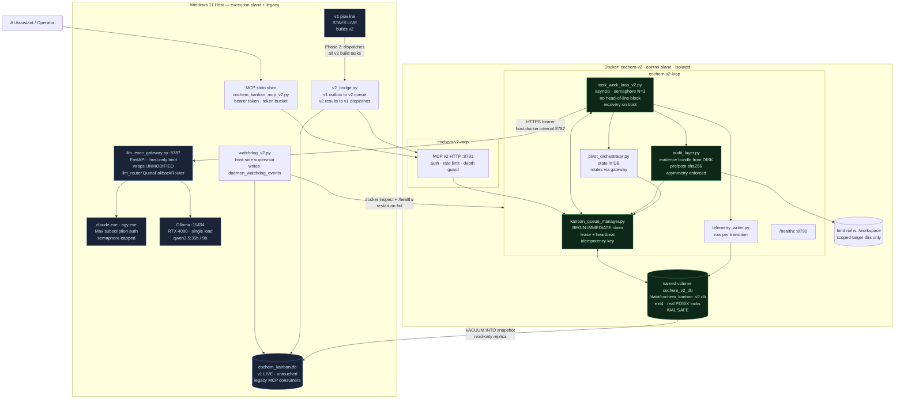
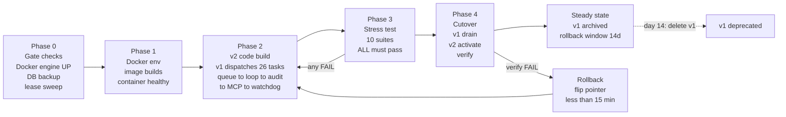

# CoChem Kanban Pipeline v2 — System Requirements Specification

| Field | Value |
|---|---|
| Document ID | `SRS-COCHEM-KANBAN-V2-20260921` |
| Version | 1.0.0 (baseline, approved for build) |
| Date | 2026-09-21 |
| Author | Claude Fable 5.1 (architect), commissioned by ansacs@gmail.com |
| Target system | CoChem Kanban Pipeline v2 |
| Host | Windows 11 Pro 26200, RTX 4090 (24 GB VRAM), 32 GB RAM |
| Supersedes | v1 runtime (`cochem_kanban.py`, `.scripts/task_work_loop.py`) |
| Build executor | v1 pipeline (self-hosting migration) |
| Status of v1 during build | **LIVE — must not be disrupted** |

### Grounding note

Every claim about v1 in this document was verified against the live system on 2026-09-21, not
inferred from summary. Verified artifacts:

- `cochem_kanban.py` 523 lines, `cochem_kanban_mcp.py` 102 lines, `llm_router.py` 772 lines,
  `pivot_council.py` 253 lines, `.scripts/task_work_loop.py` 390 lines.
- `cochem_kanban.db`: `journal_mode=wal`, 1.99 MB main file, **4.12 MB WAL** (never checkpointed),
  `kanban_tasks` = 2525 rows, `kanban_tasks_archive` = 1684, `kanban_telemetry` = 75,
  `daemon_watchdog_events` = 52, `credit_ledger` = 0, `system_metadata` = 20.
- `kanban_tasks.status` distribution: `done` 1601, **`todo` 716**, `quarantine` 149, `blocked` 45,
  `in-progress` 13, `in-review` 1.
- `kanban_tasks.assigned_agent` is `NULL` for 2524 of 2525 rows.
- 13 `in-progress` rows hold `worker_lock_id`/`worker_pid` with `lease_expires_at` in the past
  (latest 2026-09-21T13:20Z) — the lease sweeper is not running.
- `docker --version` → 29.6.1; `docker info` → **engine unreachable**
  (`npipe:////./pipe/dockerDesktopLinuxEngine` does not exist).
- Installed: Python + pydantic 2.13.4, mcp 1.29.0, pytest 9.1.1, pytest-asyncio 1.4.0,
  pytest-cov 7.1.0, pytest-json-report 1.5.0, psutil 7.2.2, fastapi 0.141.1, uvicorn 0.52.1,
  httpx 0.28.1. **`aiosqlite` is NOT installed.**
- 33 files pending in `.scripts/prompts/`.

Three findings below materially changed the architecture versus the brief as stated. They are
called out in §1.4 and resolved in ADR-001, ADR-002 and ADR-003. The rest of the document is
written on the assumption those decisions stand.

---

## 1. Executive Summary

### 1.1 What v2 is

CoChem Kanban Pipeline v2 is a rewrite of the orchestration layer that dispatches, executes,
audits and records agentic work tasks for the CoChem project. It replaces a filesystem-polled,
single-threaded, non-transactional daemon with a **transactional SQLite-WAL work queue**, a
**bounded-concurrency async executor**, a **mandatory asymmetric audit gate**, and a
**supervised, containerised runtime**. The functional surface that the AI assistant and the
human operator interact with — Kanban triggers, agent names, model-fallback chains — is
preserved. The machinery underneath it changes completely.

v2 is not a refactor of `task_work_loop.py`. The v1 loop's core assumptions — that the queue is
a directory of JSON files, that one task runs at a time, that completion state lives in a
JSON file that is deleted whenever the queue drains — are each individually fatal and are not
repairable by patching. v2 introduces new modules (`kanban_queue_manager.py`,
`task_work_loop_v2.py`, `audit_layer.py`, `cochem_kanban_mcp_v2.py`, `watchdog_v2.py`) that
coexist with v1 until a formal cutover.

### 1.2 The problems it solves

**Work is silently lost.** v1's completion ledger is `.scripts/work_loop_state.json`. When the
prompt directory drains, `main()` executes `os.remove(STATE_FILE)` — the record of every
completed task is deleted. Any `*_prompt.json` still on disk (33 files are on disk right now)
becomes eligible for re-execution on the next cycle. `save_state()` compounds this: it writes a
`.tmp` file, then `os.remove()`s the real file, then renames — a crash in that two-syscall
window leaves no state file at all. Meanwhile the durable, WAL-journalled, 2525-row
`kanban_tasks` table that was built for exactly this purpose is **never read or written by the
work loop**. The 716 `todo` rows in it have never been executed by this daemon.

**A single bad task stops the pipeline.** v1's dispatch loop is `for task_file in prompt_files:`
with a bare `break` on failure. One task that exhausts its cycles blocks every task behind it —
classic head-of-line blocking, on a strictly serial executor, with no concurrency and no
priority. On a 24-core/4090 host the pipeline runs one LLM call at a time.

**The audit does not audit.** This is the most serious finding. v1's `process_task()` builds the
auditor's evidence bundle from `exec_data_raw.get("modified_files", [])`, parsed out of
`exec_text`. But `exec_text` comes from `safe_chat_cli(agent_name, prompt)` called with the
default `extract_type="text"` — it is prose, not JSON. The `json.loads` is guarded by
`except Exception: pass`, so `modified_files` is **always `[]`**, `disk_dump` is **always the
empty string**, and `cochem-audit` is asked to verify physical work against zero bytes of
physical evidence. The anti-spoofing gate that the whole design rests on is a no-op, and it
fails open: the auditor sees a plausible summary and no contradicting evidence, so it returns
`PASS`. `native_spoofing_flag` is initialised to `False` and never assigned, making the
spoofing branch dead code. The loop over claimed files also uses `break` where `continue` is
meant, so one missing file truncates the evidence for all files after it.

**Crashes take the host with them.** Every LLM call is a `subprocess.run` of `claude.exe` or
`agy.exe` with `--dangerously-skip-permissions` / `bypassPermissions`, unbounded in count,
writing anywhere on `D:\`. There is no process budget, no memory cap, no filesystem boundary.
The `daemon_watchdog_events` table records the consequence: `kanban_daemon` has been
`RESUSCITATED` 21 times.

**Nothing is observable.** `kanban_telemetry` holds 75 rows, all written by an unrelated
`typesetting_publisher` worker, the most recent on 2026-09-19. The Kanban work loop has never
written a telemetry row. There is no record of which model ran which task, what it cost, how
long it took, or why it failed. `credit_ledger` is empty. Pivot-council state lives in a
module-level dict (`_pivot_counts`) that evaporates on restart, so a task can pivot forever
across daemon lifetimes.

### 1.3 Why it matters

The pipeline's purpose is to let the operator dispatch high-value, long-running agentic work and
walk away. Every defect above converts unattended time into either lost work or silently
fabricated work. The audit defect is the worst of the three classes: a pipeline that loses work
is annoying and self-evident, but a pipeline whose anti-spoofing gate fails open produces
confident `PASS` verdicts on work that was never done, and writes nothing to the telemetry
table that would let anyone discover it later. The 149 `quarantine` and 45 `blocked` rows are
the visible residue; the invisible residue is unknown.

v2 makes each of these structurally impossible rather than unlikely. Claims are transactional
(a task cannot be executed twice, and cannot be forgotten). Audits are evidence-bound (the
auditor receives bytes read from disk by the orchestrator, keyed to a content hash captured
before and after execution, and a task whose evidence bundle is empty is failed by the
orchestrator before any auditor is consulted). Audits are asymmetric by construction (the
verifying `(agent, provider, model)` triple is compared against the producing triple and the
audit is rejected if they match). Execution is bounded (concurrency cap, PID cap, memory cap,
container filesystem boundary). Everything is recorded (append-only event log plus a telemetry
row per state transition).

### 1.4 Deviations from the brief, and why

Three requirements in the brief cannot be implemented literally. Each is resolved with a
decision record; the work is delivered in full under the stated decision.

1. **"v2 runs in a Docker container", combined with "SQLite WAL as primary queue".** SQLite's
   WAL mode requires a shared-memory segment (`-shm`) and working POSIX advisory locks. Docker
   Desktop on Windows bind-mounts `D:\` through a virtiofs/9p translation layer that does not
   provide either reliably; SQLite's own documentation warns against WAL on such filesystems.
   Bind-mounting `d:\__CoChem\cochem_kanban.db` into the container as the live queue risks
   silent corruption of a 2525-row production database. **Resolution (ADR-001):** the v2 queue
   database lives on a Docker **named volume** (real ext4 inside the VM), seeded from a snapshot
   of the host DB; the host DB remains v1's and is never opened by the container. A bridge
   process reconciles the two. See §3.1.3 and §4.

2. **"Model routing preserved" inside a Linux container.** `ClaudeSubscriptionProvider` shells
   out to `claude.exe` and `GeminiProvider` to `agy.exe`. These are Windows PE binaries carrying
   the operator's Max-plan subscription authentication; they cannot execute under Linux.
   **Resolution (ADR-002):** a two-plane split. The control plane (queue, loop, audit, watchdog,
   MCP) runs in the container. The execution plane runs on the host as `llm_exec_gateway.py`, a
   thin FastAPI service that wraps **the existing, unmodified `llm_router.QuotaFallbackRouter`**
   and exposes it over authenticated HTTP. Routing is therefore preserved literally — the same
   `MODEL_REGISTRY`, the same fallback chains, the same subscription auth — rather than
   reimplemented. See §3.7.

3. **"BSOD-proof".** A container cannot make a machine BSOD-proof: Docker Desktop shares the
   Windows kernel through WSL2, and the historical BSOD vector on this host is the NVIDIA
   display driver under VRAM exhaustion, which is a host-kernel event. **Resolution (ADR-003):**
   v2 targets the actual causes. Ollama is **not** containerised (§3.1.4) — the GPU cannot hold
   both a host-resident `qwen3.5:35b` and a container-resident copy, and double-loading is the
   VRAM-exhaustion path. **Correction to the brief:** the brief states an RTX 4090, but
   `nvidia-smi` on this host reports `NVIDIA GeForce RTX 3090, 24576 MiB`. The distinction is
   load-bearing rather than pedantic: `ollama list` shows `qwen3.5:35b` at **23.9 GB** against
   **24.0 GB** of VRAM, so the final Ollama fallback tier for `0rchestrator`, `pivot-planner` and
   `pivot-architect` consumes essentially the entire card and leaves no room for a second
   resident model, a display surface, or any CUDA workload. That is the precise reason Ollama
   stays on the host as a single shared instance, and the precise reason §3.6.1's watchdog
   alerts above 90 % VRAM. Spawn storms are capped by `pids_limit`, a hard concurrency
   semaphore, and a container `mem_limit`. The container does deliver genuine protection against
   the failure modes it can address: runaway agent filesystem writes, port exhaustion, orphan
   process accumulation, and dependency contamination of the host Python environment. This is
   stated plainly rather than overclaimed.

---

## 2. Architecture Overview

### 2.1 v1 (as-built, verified 2026-09-21)

```mermaid
flowchart TB
    subgraph HOST1["Windows 11 Host — v1, everything in one trust domain"]
        AI["AI Assistant / Operator"]
        MCP1["cochem_kanban_mcp.py<br/>PID 39600 · 7 tools<br/>no auth · no rate limit<br/>no subprocess timeout"]
        CLI1["cochem_kanban.py<br/>523 lines · argparse dispatcher"]
        FS[("`.scripts/prompts/*.json`<br/>33 files pending<br/>NOT transactional")]
        LOOP1["task_work_loop.py<br/>serial · glob poll 15s<br/>break on first failure"]
        STATE[("work_loop_state.json<br/>DELETED when queue drains")]
        ROUTER1["llm_router.py<br/>QuotaFallbackRouter<br/>PIPELINE_PAUSED_FOR_QUOTA<br/>in-memory module flag"]
        PIVOT1["pivot_council.py<br/>_pivot_counts in RAM<br/>bypasses QuotaFallbackRouter"]
        EXE["claude.exe · agy.exe<br/>bypassPermissions<br/>unbounded spawn"]
        OLL1["Ollama :11434<br/>RTX 4090"]
        DB1[("cochem_kanban.db<br/>2525 tasks · 716 todo<br/>WAL 4.12MB uncheckpointed<br/>NEVER READ BY LOOP")]
    end

    AI --> MCP1 --> CLI1 --> FS --> LOOP1
    LOOP1 <--> STATE
    LOOP1 --> ROUTER1 --> EXE
    ROUTER1 --> OLL1
    LOOP1 --> PIVOT1 --> ROUTER1
    LOOP1 -. "audit evidence<br/>ALWAYS EMPTY" .-> AUD1["cochem-audit<br/>fails OPEN"]
    DB1 -. "orphaned:<br/>no writer, no reader" .-> LOOP1

    classDef bad fill:#3b0d0d,stroke:#d04040,color:#ffd7d7
    classDef orphan fill:#2a2a12,stroke:#b8a33a,color:#f4ecc0
    class FS,STATE,AUD1,EXE bad
    class DB1,PIVOT1 orphan
```

### 2.2 v2 (target)



### 2.3 Migration path



### 2.4 Component inventory

| # | Component | File | Plane | New/Changed | Lines (est.) |
|---|---|---|---|---|---|
| 1 | Queue manager | `v2/kanban_queue_manager.py` | container | NEW | ~520 |
| 2 | Work loop | `v2/task_work_loop_v2.py` | container | NEW (replaces v1 loop) | ~640 |
| 3 | Audit layer | `v2/audit_layer.py` | container | NEW | ~430 |
| 4 | Pivot orchestrator | `v2/pivot_orchestrator.py` | container | NEW (wraps v1 council) | ~280 |
| 5 | Telemetry writer | `v2/telemetry_writer.py` | container | NEW | ~180 |
| 6 | MCP server v2 | `v2/cochem_kanban_mcp_v2.py` | both | NEW | ~460 |
| 7 | LLM exec gateway | `v2/llm_exec_gateway.py` | **host** | NEW | ~340 |
| 8 | Watchdog | `v2/watchdog_v2.py` | **host** | NEW | ~360 |
| 9 | v1→v2 bridge | `v2/v2_bridge.py` | **host** | NEW | ~240 |
| 10 | Migration SQL | `v2/db_migrations/002_v2_queue.sql` | — | NEW | ~120 |
| 11 | Dockerfile | `v2/Dockerfile` | — | NEW | ~70 |
| 12 | Compose | `v2/docker-compose.yml` | — | NEW | ~120 |
| 13 | LLM router | `llm_router.py` | host | **UNMODIFIED** | 772 |
| 14 | Pivot council | `pivot_council.py` | host | 1 fix (§3.6.3) | 253 |
| 15 | v1 CLI | `cochem_kanban.py` | host | 2 fixes (§5 Task 1.01–1.02) | 523 |

---

## 3. Component Specifications

### 3.1 Docker Test Environment

#### 3.1.1 Directory layout

```
d:\__CoChem\__agentic\v2\
├── Dockerfile
├── docker-compose.yml
├── .dockerignore
├── requirements.v2.txt
├── entrypoint.sh
├── kanban_queue_manager.py
├── task_work_loop_v2.py
├── audit_layer.py
├── pivot_orchestrator.py
├── telemetry_writer.py
├── cochem_kanban_mcp_v2.py
├── llm_exec_gateway.py          # runs on HOST, not in image
├── watchdog_v2.py               # runs on HOST, not in image
├── v2_bridge.py                 # runs on HOST, not in image
├── config.py
├── db_migrations/
│   ├── 002_v2_queue.sql
│   └── 003_v2_indexes.sql
├── scripts/
│   ├── seed_v2_db.py
│   ├── snapshot_host_db.py
│   └── healthcheck.py
└── tests/
    ├── conftest.py
    ├── test_queue_manager.py
    ├── test_throughput.py
    ├── test_fault_injection.py
    ├── test_quota_exhaustion.py
    ├── test_audit_rejection.py
    ├── test_recovery.py
    ├── test_race_conditions.py
    ├── test_telemetry.py
    ├── test_mcp_auth.py
    └── test_cutover_readiness.py
```

#### 3.1.2 `requirements.v2.txt`

Pinned to the versions verified present on the host, so container and host behave identically.
`aiosqlite` is **not** used: the queue manager runs synchronous `sqlite3` inside
`asyncio.to_thread`, because `BEGIN IMMEDIATE` claim transactions must be genuinely serialised
and `aiosqlite`'s single-connection-per-object model provides no advantage for transactions that
are held for under 5 ms. This also removes a dependency that is absent on the host.

```
# requirements.v2.txt — CoChem Kanban v2 control plane
pydantic==2.13.4
mcp==1.29.0
fastapi==0.141.1
uvicorn[standard]==0.52.1
httpx==0.28.1
psutil==7.2.2
python-dotenv==1.1.1
tenacity==9.1.2

# test-only
pytest==9.1.1
pytest-asyncio==1.4.0
pytest-cov==7.1.0
pytest-json-report==1.5.0
pytest-mock==3.15.1
freezegun==1.5.2
```

#### 3.1.3 `Dockerfile`

```dockerfile
# syntax=docker/dockerfile:1.7
# CoChem Kanban Pipeline v2 — control plane image
# Control plane ONLY. No claude.exe / agy.exe (Windows PE, cannot run here — ADR-002).
# LLM execution is delegated to llm_exec_gateway.py on the host.

FROM python:3.12-slim-bookworm AS base

ENV PYTHONUNBUFFERED=1 \
    PYTHONDONTWRITEBYTECODE=1 \
    PIP_NO_CACHE_DIR=1 \
    PIP_DISABLE_PIP_VERSION_CHECK=1 \
    TZ=America/Chicago

# sqlite3 CLI is required by healthcheck.py and by the operator runbook in §4.4.
# curl is required by the compose healthcheck. git is required by audit evidence collection
# (post-execution `git diff --stat` on mounted workspaces, when the target is a repo).
RUN apt-get update && apt-get install -y --no-install-recommends \
        sqlite3 curl ca-certificates git tini \
    && rm -rf /var/lib/apt/lists/*

# Non-root. UID/GID 10001 is arbitrary but fixed so volume ownership is stable across rebuilds.
RUN groupadd -g 10001 cochem && useradd -u 10001 -g 10001 -m -s /bin/bash cochem

WORKDIR /app

COPY requirements.v2.txt .
RUN pip install --no-cache-dir -r requirements.v2.txt

# ---- runtime stage -----------------------------------------------------------
FROM base AS runtime

COPY --chown=cochem:cochem . /app/

# /data  -> named volume, holds cochem_kanban_v2.db (ext4, real POSIX locks, WAL-safe)
# /logs  -> named volume, structured JSONL logs
# /workspace -> bind mount, scoped target directories only
RUN mkdir -p /data /logs /workspace && chown -R cochem:cochem /data /logs /workspace

USER cochem

# tini reaps zombies — replaces v1's psutil-based zombie_sweeper, which only ran atexit.
ENTRYPOINT ["/usr/bin/tini", "--", "/app/entrypoint.sh"]
CMD ["loop"]

HEALTHCHECK --interval=20s --timeout=10s --start-period=30s --retries=3 \
    CMD ["python", "/app/scripts/healthcheck.py"]
```

#### 3.1.4 `docker-compose.yml`

Design decisions embedded here, each deliberate:

- **`cochem_v2_db` is a named volume, not a bind mount** (ADR-001). This is the single most
  important line in the file. A bind mount of `d:\__CoChem` would place a WAL database on a
  virtiofs translation layer without reliable advisory locking.
- **No `ollama` service by default.** ADR-003: the host already serves Ollama on `:11434` with
  models resident in the 4090's 24 GB. A containerised second instance would double-load weights
  (`qwen3.5:35b` at q4 is ~20 GB) and is the VRAM-exhaustion → driver-reset → BSOD path this
  whole exercise is meant to close. The container reaches the host instance via
  `host.docker.internal`. An opt-in `ollama-isolated` profile is provided for the case where
  full isolation is wanted and the host instance is stopped first.
- **`pids_limit`, `mem_limit`, `cpus`** are set on every service. Unbounded process spawn is the
  v1 failure mode; a limit is the mitigation.
- **`extra_hosts: host-gateway`** is required for Linux parity; Docker Desktop provides
  `host.docker.internal` natively, but the explicit entry makes the compose file portable and
  self-documenting.
- **Network is `internal: true` for the DB-adjacent bridge**, with only the loop and MCP
  services attached to the egress network. There is no reason for the queue to reach the
  internet.

```yaml
# docker-compose.yml — CoChem Kanban Pipeline v2
name: cochem-v2

x-common-env: &common-env
  V2_DB_PATH: /data/cochem_kanban_v2.db
  V2_LOG_DIR: /logs
  V2_WORKSPACE: /workspace
  V2_LLM_GATEWAY_URL: http://host.docker.internal:8787
  V2_LLM_GATEWAY_TOKEN: ${V2_LLM_GATEWAY_TOKEN:?V2_LLM_GATEWAY_TOKEN must be set}
  V2_MCP_TOKEN: ${V2_MCP_TOKEN:?V2_MCP_TOKEN must be set}
  V2_MAX_CONCURRENCY: ${V2_MAX_CONCURRENCY:-3}
  V2_POLL_INTERVAL_BUSY_MS: 2000
  V2_POLL_INTERVAL_IDLE_MS: 15000
  V2_LEASE_SECONDS: 1800
  V2_HEARTBEAT_SECONDS: 30
  V2_MAX_AUDIT_CYCLES: 3
  V2_MAX_PIVOT_CYCLES: 3
  V2_AUDIT_PASS_THRESHOLD: 85
  V2_QUEUE_DEPTH_LIMIT: 500
  OLLAMA_BASE_URL: http://host.docker.internal:11434
  TZ: America/Chicago

x-common-limits: &common-limits
  mem_limit: 4g
  memswap_limit: 4g
  cpus: "4.0"
  pids_limit: 256
  restart: unless-stopped
  security_opt:
    - no-new-privileges:true
  cap_drop:
    - ALL
  logging:
    driver: json-file
    options:
      max-size: "50m"
      max-file: "5"

services:
  # ── Control plane: the work loop ───────────────────────────────────────────
  loop:
    build:
      context: .
      dockerfile: Dockerfile
      target: runtime
    image: cochem-v2:${V2_TAG:-latest}
    container_name: cochem-v2-loop
    <<: *common-limits
    environment:
      <<: *common-env
      V2_ROLE: loop
    command: ["loop"]
    volumes:
      - cochem_v2_db:/data
      - cochem_v2_logs:/logs
      # Scoped workspace bind mounts. NOT the whole of D:\__CoChem.
      # Read-write only where the coder must actually write.
      - type: bind
        source: d:/__CoChem/__agentic/v2
        target: /workspace/v2
        read_only: false
      - type: bind
        source: d:/__CoChem/__agentic/dropzones
        target: /workspace/dropzones
        read_only: false
      # Reference material the agents read but must never modify.
      - type: bind
        source: d:/__CoChem/__agentic/llm_router.py
        target: /workspace/ref/llm_router.py
        read_only: true
      - type: bind
        source: d:/__CoChem/__agentic/claude_agent_profiles.py
        target: /workspace/ref/claude_agent_profiles.py
        read_only: true
    ports:
      - "127.0.0.1:8790:8790"     # /healthz — loopback only
    extra_hosts:
      - "host.docker.internal:host-gateway"
    networks:
      - v2_internal
      - v2_egress
    healthcheck:
      test: ["CMD", "python", "/app/scripts/healthcheck.py"]
      interval: 20s
      timeout: 10s
      start_period: 30s
      retries: 3
    stop_grace_period: 120s        # graceful drain: finish in-flight tasks (§3.3.6)

  # ── Control plane: MCP v2 ──────────────────────────────────────────────────
  mcp:
    image: cochem-v2:${V2_TAG:-latest}
    container_name: cochem-v2-mcp
    <<: *common-limits
    mem_limit: 1g
    memswap_limit: 1g
    cpus: "1.0"
    pids_limit: 64
    depends_on:
      loop:
        condition: service_healthy
    environment:
      <<: *common-env
      V2_ROLE: mcp
    command: ["mcp"]
    volumes:
      - cochem_v2_db:/data
      - cochem_v2_logs:/logs
    ports:
      - "127.0.0.1:8791:8791"
    extra_hosts:
      - "host.docker.internal:host-gateway"
    networks:
      - v2_internal
    healthcheck:
      test: ["CMD", "curl", "-fsS", "-H", "Authorization: Bearer ${V2_MCP_TOKEN}",
             "http://localhost:8791/healthz"]
      interval: 20s
      timeout: 10s
      start_period: 20s
      retries: 3

  # ── Test runner: one-shot, profile-gated ──────────────────────────────────
  tests:
    image: cochem-v2:${V2_TAG:-latest}
    container_name: cochem-v2-tests
    profiles: ["test"]
    mem_limit: 4g
    pids_limit: 512
    environment:
      <<: *common-env
      V2_ROLE: tests
      V2_DB_PATH: /data/test_kanban_v2.db
      V2_LLM_GATEWAY_URL: http://localhost:9999   # stub; tests inject a fake gateway
    command: ["tests"]
    volumes:
      - cochem_v2_db:/data
      - cochem_v2_logs:/logs
      - type: bind
        source: d:/__CoChem/__agentic/v2/.test-reports
        target: /reports
    extra_hosts:
      - "host.docker.internal:host-gateway"
    networks:
      - v2_internal

  # ── OPT-IN only: fully isolated Ollama. Stop the host instance first. ─────
  # Activate with:  docker compose --profile ollama-isolated up -d
  # ADR-003: do NOT run this alongside host Ollama — 24 GB VRAM cannot hold two copies
  # of qwen3.5:35b, and VRAM exhaustion is the driver-reset/BSOD vector.
  ollama:
    image: ollama/ollama:0.12.3
    container_name: cochem-v2-ollama
    profiles: ["ollama-isolated"]
    restart: unless-stopped
    mem_limit: 16g
    volumes:
      - ollama_models:/root/.ollama
    ports:
      - "127.0.0.1:11435:11434"
    networks:
      - v2_internal
    deploy:
      resources:
        reservations:
          devices:
            - driver: nvidia
              count: all
              capabilities: [gpu]
    healthcheck:
      test: ["CMD", "curl", "-fsS", "http://localhost:11434/api/tags"]
      interval: 30s
      timeout: 10s
      retries: 3

volumes:
  cochem_v2_db:
    name: cochem_v2_db
  cochem_v2_logs:
    name: cochem_v2_logs
  ollama_models:
    name: cochem_v2_ollama_models

networks:
  v2_internal:
    internal: true          # no egress: the queue has no business on the internet
  v2_egress:
    driver: bridge
```

#### 3.1.5 `entrypoint.sh`

```bash
#!/usr/bin/env bash
# CoChem v2 entrypoint. Applies migrations, then dispatches on role.
set -Eeuo pipefail

ROLE="${1:-${V2_ROLE:-loop}}"
DB="${V2_DB_PATH:-/data/cochem_kanban_v2.db}"

log() { printf '%s [entrypoint] %s\n' "$(date -Is)" "$*" >&2; }

# Fail fast and loudly on missing secrets rather than starting an unauthenticated service.
: "${V2_LLM_GATEWAY_TOKEN:?missing}"
: "${V2_MCP_TOKEN:?missing}"

if [ ! -f "$DB" ]; then
    log "No database at $DB — seeding a fresh v2 queue."
    python /app/scripts/seed_v2_db.py --db "$DB"
fi

log "Applying migrations to $DB"
for f in /app/db_migrations/*.sql; do
    log "  -> $(basename "$f")"
    sqlite3 "$DB" < "$f"
done

# WAL hygiene: v1's WAL grew to 4.12 MB against a 1.99 MB main DB because nothing ever
# checkpointed. Cap it at boot and let SQLite autocheckpoint from there.
sqlite3 "$DB" "PRAGMA journal_mode=WAL; PRAGMA journal_size_limit=67108864; PRAGMA wal_checkpoint(TRUNCATE);"

case "$ROLE" in
  loop)  log "role=loop";  exec python -m task_work_loop_v2 ;;
  mcp)   log "role=mcp";   exec python -m cochem_kanban_mcp_v2 --transport http --host 0.0.0.0 --port 8791 ;;
  tests) log "role=tests"; exec pytest /app/tests -v --tb=short \
                                  --json-report --json-report-file=/reports/stress-report.json \
                                  --cov=/app --cov-report=term-missing ;;
  shell) exec /bin/bash ;;
  *)     log "unknown role: $ROLE"; exit 64 ;;
esac
```

#### 3.1.6 `scripts/healthcheck.py`

The health check must prove three independent things: the process is alive, the DB is writable,
and the loop is actually progressing (not deadlocked while alive). Checking only liveness is how
v1's watchdog missed 21 hangs.

```python
#!/usr/bin/env python3
"""v2 container health check. Exit 0 = healthy, 1 = unhealthy.

Verifies:
  1. HTTP /healthz responds (process alive, event loop responsive)
  2. Queue DB accepts a write (WAL not wedged, volume not full)
  3. Heartbeat is fresh (loop progressing, not deadlocked-but-alive)
"""
import json
import os
import sqlite3
import sys
import time
import urllib.request

DB = os.environ.get("V2_DB_PATH", "/data/cochem_kanban_v2.db")
ROLE = os.environ.get("V2_ROLE", "loop")
PORT = 8791 if ROLE == "mcp" else 8790
STALE_AFTER = int(os.environ.get("V2_HEARTBEAT_SECONDS", "30")) * 4  # 120s default


def fail(msg: str) -> None:
    print(f"UNHEALTHY: {msg}", file=sys.stderr)
    sys.exit(1)


def main() -> None:
    # 1. HTTP liveness
    url = f"http://localhost:{PORT}/healthz"
    req = urllib.request.Request(url)
    if ROLE == "mcp":
        req.add_header("Authorization", f"Bearer {os.environ['V2_MCP_TOKEN']}")
    try:
        with urllib.request.urlopen(req, timeout=8) as r:
            if r.status != 200:
                fail(f"/healthz returned HTTP {r.status}")
            body = json.loads(r.read())
    except Exception as exc:
        fail(f"/healthz unreachable: {exc}")

    if body.get("status") not in ("ok", "paused_quota"):
        fail(f"/healthz status={body.get('status')} detail={body.get('detail')}")

    # 2. DB writability — proves the volume is mounted rw and WAL is not wedged
    try:
        conn = sqlite3.connect(DB, timeout=8)
        conn.execute("PRAGMA busy_timeout=8000")
        conn.execute(
            "INSERT INTO system_metadata(key, value, updated_at) VALUES(?,?,datetime('now')) "
            "ON CONFLICT(key) DO UPDATE SET value=excluded.value, updated_at=excluded.updated_at",
            (f"v2_healthcheck_{ROLE}", str(time.time())),
        )
        conn.commit()
        conn.close()
    except Exception as exc:
        fail(f"DB write failed: {exc}")

    # 3. Heartbeat freshness — catches alive-but-deadlocked, v1's blind spot.
    # A paused pipeline still heartbeats, so this is valid in paused_quota state too.
    if ROLE == "loop":
        age = body.get("heartbeat_age_sec")
        if age is None or age > STALE_AFTER:
            fail(f"heartbeat stale: age={age}s limit={STALE_AFTER}s")

    print(f"HEALTHY role={ROLE} {json.dumps(body)}")
    sys.exit(0)


if __name__ == "__main__":
    main()
```

#### 3.1.7 Operational commands

```powershell
# Prerequisite gate — verified FAILING on 2026-09-21. Must pass before Phase 1.
docker info --format '{{.ServerVersion}} {{.OSType}}'   # expect: 29.x linux

# One-time secret generation (32-byte urlsafe tokens)
$env:V2_MCP_TOKEN         = python -c "import secrets;print(secrets.token_urlsafe(32))"
$env:V2_LLM_GATEWAY_TOKEN = python -c "import secrets;print(secrets.token_urlsafe(32))"
# Persist to v2\.env (chmod 600 equivalent: remove inherited ACLs)

# Build + start
docker compose -f d:\__CoChem\__agentic\v2\docker-compose.yml build
docker compose -f d:\__CoChem\__agentic\v2\docker-compose.yml up -d loop mcp

# Verify
docker compose ps
docker inspect --format '{{.State.Health.Status}}' cochem-v2-loop   # expect: healthy
curl.exe -fsS http://127.0.0.1:8790/healthz

# Stress suite
docker compose --profile test run --rm tests

# Logs
docker compose logs -f --tail=100 loop
```

### 3.2 SQLite WAL Queue Manager — `kanban_queue_manager.py`

This module is the whole point of v2. It replaces `glob.glob()` + `work_loop_state.json` with
transactional claims against `kanban_tasks`.

#### 3.2.1 Schema additions — `db_migrations/002_v2_queue.sql`

**Strictly additive.** v1 reads none of these columns and is unaffected. The critical line is the
`queue_version` default: it makes the 716 existing `todo` rows **invisible to v2**. Without it,
the first v2 boot would claim 716 legacy tasks of types `consensus_extract`, `quick_reference`,
`scout_audit` and dispatch them at LLM cost, which would be a self-inflicted incident on day one.

```sql
-- 002_v2_queue.sql — additive v2 queue schema. Idempotent.
-- v1 compatibility: every ALTER has a DEFAULT, so existing 2525 rows stay valid and
-- v1's INSERTs (which do not name these columns) continue to work unchanged.

PRAGMA foreign_keys = ON;

-- ── kanban_tasks: v2 columns ───────────────────────────────────────────────
-- SQLite has no ADD COLUMN IF NOT EXISTS; the runner in seed_v2_db.py inspects
-- PRAGMA table_info and skips columns already present. Listed here as the contract.

-- queue_version: THE migration firewall.
--   'v1' = legacy row, invisible to v2 (716 todo rows are all 'v1')
--   'v2' = claimable by task_work_loop_v2
--   'v2-test' = claimable only when V2_TEST_MODE=1
ALTER TABLE kanban_tasks ADD COLUMN queue_version TEXT NOT NULL DEFAULT 'v1';

ALTER TABLE kanban_tasks ADD COLUMN priority INTEGER NOT NULL DEFAULT 3;   -- 1 crit,2 high,3 normal
ALTER TABLE kanban_tasks ADD COLUMN prompt_text TEXT;                      -- inline prompt (no FS dep)
ALTER TABLE kanban_tasks ADD COLUMN audit_status TEXT NOT NULL DEFAULT 'not_required';
       -- not_required | pending | in_progress | pass | fail | spoofing_detected | rejected_symmetry
ALTER TABLE kanban_tasks ADD COLUMN audit_cycles INTEGER NOT NULL DEFAULT 0;
ALTER TABLE kanban_tasks ADD COLUMN pivot_cycles INTEGER NOT NULL DEFAULT 0;
ALTER TABLE kanban_tasks ADD COLUMN last_error TEXT;
ALTER TABLE kanban_tasks ADD COLUMN result_uri TEXT;
ALTER TABLE kanban_tasks ADD COLUMN idempotency_key TEXT;                  -- dedupe on submit
ALTER TABLE kanban_tasks ADD COLUMN not_before TIMESTAMP;                  -- backoff / scheduling
ALTER TABLE kanban_tasks ADD COLUMN claim_count INTEGER NOT NULL DEFAULT 0;-- poison-task detection
ALTER TABLE kanban_tasks ADD COLUMN evidence_sha256 TEXT;                  -- pre-exec workspace hash

CREATE UNIQUE INDEX IF NOT EXISTS idx_kanban_idempotency
    ON kanban_tasks(idempotency_key) WHERE idempotency_key IS NOT NULL;

-- The claim hot path. Partial index keeps it tiny: only v2 + todo rows are indexed,
-- so the 1601 'done' and 716 legacy-'todo' rows cost nothing to skip.
CREATE INDEX IF NOT EXISTS idx_v2_claim
    ON kanban_tasks(priority, created_at)
    WHERE queue_version IN ('v2','v2-test') AND status = 'todo';

CREATE INDEX IF NOT EXISTS idx_v2_lease_sweep
    ON kanban_tasks(lease_expires_at)
    WHERE status = 'in-progress';

CREATE INDEX IF NOT EXISTS idx_v2_audit_queue
    ON kanban_tasks(audit_status, updated_at)
    WHERE status = 'in-review';

-- ── Append-only event log. The durable audit trail v1 never had. ──────────
CREATE TABLE IF NOT EXISTS kanban_task_events (
    event_id      INTEGER PRIMARY KEY AUTOINCREMENT,
    task_id       TEXT    NOT NULL,
    event_type    TEXT    NOT NULL,   -- SUBMITTED|CLAIMED|LEASE_RENEWED|EXEC_STARTED|
                                      -- EXEC_COMPLETED|EXEC_FAILED|AUDIT_STARTED|AUDIT_PASS|
                                      -- AUDIT_FAIL|SPOOFING_DETECTED|SYMMETRY_REJECTED|
                                      -- REVISION_DISPATCHED|PIVOT_STARTED|PIVOT_REQUEUED|
                                      -- REQUEUED|LEASE_EXPIRED|QUARANTINED|PAUSED_QUOTA|
                                      -- RESUMED|COMPLETED|CANCELLED
    worker_id     TEXT,
    agent_name    TEXT,
    provider      TEXT,
    model         TEXT,
    detail_json   TEXT,               -- structured payload, <= 64 KiB
    created_at    TIMESTAMP NOT NULL DEFAULT CURRENT_TIMESTAMP
);
CREATE INDEX IF NOT EXISTS idx_events_task ON kanban_task_events(task_id, event_id);
CREATE INDEX IF NOT EXISTS idx_events_type_time ON kanban_task_events(event_type, created_at);

-- ── Audit results: one row per audit cycle. Asymmetry proof lives here. ──
CREATE TABLE IF NOT EXISTS kanban_audit_results (
    audit_id          INTEGER PRIMARY KEY AUTOINCREMENT,
    task_id           TEXT    NOT NULL,
    cycle             INTEGER NOT NULL,
    verdict           TEXT    NOT NULL,   -- PASS|FAIL|SPOOFING_DETECTED|INDETERMINATE
    score             INTEGER,            -- 0-100
    critique          TEXT,
    findings_json     TEXT,               -- [{severity,file,line,issue}]
    -- Producer triple
    exec_agent        TEXT    NOT NULL,
    exec_provider     TEXT    NOT NULL,
    exec_model        TEXT    NOT NULL,
    -- Verifier triple
    audit_agent       TEXT    NOT NULL,
    audit_provider    TEXT    NOT NULL,
    audit_model       TEXT    NOT NULL,
    asymmetry_ok      INTEGER NOT NULL,   -- 0 => audit invalid, escalate (§3.4.4)
    evidence_files    INTEGER NOT NULL,   -- count of files in bundle; 0 => auto-FAIL
    evidence_bytes    INTEGER NOT NULL,
    evidence_sha256   TEXT,
    created_at        TIMESTAMP NOT NULL DEFAULT CURRENT_TIMESTAMP,
    UNIQUE(task_id, cycle)
);
CREATE INDEX IF NOT EXISTS idx_audit_task ON kanban_audit_results(task_id, cycle);

-- ── Pivot state: durable, replacing v1's in-RAM _pivot_counts dict. ──────
CREATE TABLE IF NOT EXISTS kanban_pivot_state (
    pivot_id        INTEGER PRIMARY KEY AUTOINCREMENT,
    task_id         TEXT    NOT NULL,
    cycle           INTEGER NOT NULL,
    stage           TEXT    NOT NULL,   -- research|architect|planner|requeued|hard_abort
    agent_name      TEXT,
    provider        TEXT,
    model           TEXT,
    output_text     TEXT,
    failure_trace   TEXT,
    new_task_id     TEXT,               -- task created by the planner, if any
    created_at      TIMESTAMP NOT NULL DEFAULT CURRENT_TIMESTAMP,
    UNIQUE(task_id, cycle, stage)
);
CREATE INDEX IF NOT EXISTS idx_pivot_task ON kanban_pivot_state(task_id, cycle);

-- ── Worker registry: cross-restart recovery + race-free worker identity. ─
CREATE TABLE IF NOT EXISTS kanban_workers (
    worker_id       TEXT PRIMARY KEY,   -- "{hostname}:{pid}:{boot_uuid}"
    hostname        TEXT NOT NULL,
    pid             INTEGER NOT NULL,
    container_id    TEXT,
    queue_version   TEXT NOT NULL,
    started_at      TIMESTAMP NOT NULL DEFAULT CURRENT_TIMESTAMP,
    last_heartbeat  REAL    NOT NULL,
    status          TEXT    NOT NULL DEFAULT 'running',  -- running|draining|stopped|crashed
    max_concurrency INTEGER NOT NULL DEFAULT 3,
    in_flight       INTEGER NOT NULL DEFAULT 0
);

-- ── Quota pause state: durable, replacing the in-memory module flag. ─────
-- v1's PIPELINE_PAUSED_FOR_QUOTA lives in llm_router's module namespace and is lost on
-- restart. These keys survive restart and are visible to the operator via SQL.
INSERT INTO system_metadata(key, value) VALUES
    ('v2_pipeline_state',        'running')  ON CONFLICT(key) DO NOTHING;
INSERT INTO system_metadata(key, value) VALUES
    ('v2_pause_until_epoch',     '0')        ON CONFLICT(key) DO NOTHING;
INSERT INTO system_metadata(key, value) VALUES
    ('v2_pause_reason',          '')         ON CONFLICT(key) DO NOTHING;
INSERT INTO system_metadata(key, value) VALUES
    ('v2_active_pipeline_version','v1')      ON CONFLICT(key) DO NOTHING;
INSERT INTO system_metadata(key, value) VALUES
    ('v2_schema_version',        '002')      ON CONFLICT(key) DO NOTHING;

-- ── Telemetry: make v2's extra columns nullable-safe. ────────────────────
-- kanban_telemetry already has NOT NULL on execution_time_ms, cpu_percent, vram_used_mb,
-- status_verdict, worker_id, state_from, state_to. v2's writer supplies all of them
-- (§3.3.7); these additions carry the routing detail v1 never recorded.
ALTER TABLE kanban_telemetry ADD COLUMN agent_name TEXT;
ALTER TABLE kanban_telemetry ADD COLUMN queue_version TEXT DEFAULT 'v2';
ALTER TABLE kanban_telemetry ADD COLUMN error_class TEXT;
ALTER TABLE kanban_telemetry ADD COLUMN cost_usd REAL DEFAULT 0.0;
```

#### 3.2.2 Canonical state model

v2 keeps v1's `status` vocabulary so legacy dashboards keep working, and adds `paused`. The
integer `current_state` / telemetry `state_from`/`state_to` mapping extends the existing
convention (existing rows use `6 → 7` for completion, so `7 = done` is preserved):

| int | name | `status` | Meaning |
|---|---|---|---|
| 0 | `QUEUED` | `todo` | Claimable |
| 1 | `CLAIMED` | `in-progress` | Lease held, not yet dispatched |
| 2 | `EXECUTING` | `in-progress` | LLM call in flight |
| 3 | `AWAITING_AUDIT` | `in-review` | Execution returned; evidence collected |
| 4 | `AUDITING` | `in-review` | Auditor call in flight |
| 5 | `REVISION` | `in-progress` | Audit FAIL; correction dispatched |
| 6 | `PIVOT` | `blocked` | Pivot council engaged |
| 7 | `DONE` | `done` | Audit PASS, terminal |
| 8 | `FAILED` | `blocked` | Retries exhausted, retryable by operator |
| 9 | `QUARANTINE` | `quarantine` | Spoofing / poison task, terminal without review |
| 10 | `PAUSED_QUOTA` | `paused` | Cloud quota exhausted, lease held, awaiting resume |

Legal transitions (anything else raises `IllegalTransition` and is logged):

```
0→1  1→2  1→0(release)  2→3  2→8  2→10  2→6
3→4  4→7  4→5  4→9  4→6  5→2  6→0(requeue)  6→8(hard_abort)
10→2(resume)  10→0(release_on_shutdown)
8→0  (operator retry)   9→(terminal)   7→(terminal)
Any→0 via lease expiry sweep, provided claim_count < POISON_THRESHOLD
```

#### 3.2.3 Interface contract

```python
"""kanban_queue_manager.py — transactional SQLite-WAL work queue for CoChem Kanban v2.

Replaces v1's glob-the-prompts-directory + work_loop_state.json with ACID claims against
kanban_tasks. Every public method is safe under N concurrent workers and process kills.

CONCURRENCY CONTRACT
    All writes use BEGIN IMMEDIATE (reserved lock acquired up front, no upgrade deadlock).
    No transaction may be held across a network or subprocess call. Transactions here are
    bounded to single-digit milliseconds; the LLM call happens strictly between them.

DURABILITY CONTRACT
    journal_mode=WAL, synchronous=NORMAL, busy_timeout=5000ms, journal_size_limit=64MiB,
    wal_autocheckpoint=1000 pages. NORMAL (not FULL) is chosen deliberately: a task
    re-executed after an OS-level crash is recoverable via the lease sweeper, whereas
    fsync-per-commit would cost ~8ms on every heartbeat at 3 concurrent workers.
"""

from __future__ import annotations

import sqlite3
from dataclasses import dataclass
from datetime import datetime, timedelta, timezone
from enum import IntEnum
from typing import Any, Iterable, Optional


class TaskState(IntEnum):
    QUEUED = 0; CLAIMED = 1; EXECUTING = 2; AWAITING_AUDIT = 3; AUDITING = 4
    REVISION = 5; PIVOT = 6; DONE = 7; FAILED = 8; QUARANTINE = 9; PAUSED_QUOTA = 10


STATUS_FOR_STATE: dict[TaskState, str] = {
    TaskState.QUEUED: "todo", TaskState.CLAIMED: "in-progress",
    TaskState.EXECUTING: "in-progress", TaskState.AWAITING_AUDIT: "in-review",
    TaskState.AUDITING: "in-review", TaskState.REVISION: "in-progress",
    TaskState.PIVOT: "blocked", TaskState.DONE: "done", TaskState.FAILED: "blocked",
    TaskState.QUARANTINE: "quarantine", TaskState.PAUSED_QUOTA: "paused",
}

LEGAL_TRANSITIONS: dict[TaskState, frozenset[TaskState]] = {...}  # per §3.2.2
POISON_THRESHOLD = 5        # claim_count beyond which a task is quarantined, not requeued


class QueueError(RuntimeError): ...
class IllegalTransition(QueueError): ...
class TaskNotClaimed(QueueError): ...
class QueueDepthExceeded(QueueError): ...
class DuplicateIdempotencyKey(QueueError): ...


@dataclass(frozen=True, slots=True)
class ClaimedTask:
    task_id: str
    workflow_type: str
    agent_name: str          # resolved: assigned_agent, else workflow default (2524 rows are NULL)
    prompt_text: str
    priority: int
    file_path: str
    payload_uri: str
    retry_count: int
    audit_cycles: int
    pivot_cycles: int
    claim_count: int
    parent_task_id: Optional[str]
    lease_expires_at: datetime
    worker_lock_id: str      # opaque claim token; every mutation must present it


class KanbanQueueManager:
    """Thread-safe, process-safe queue over kanban_tasks.

    One instance per worker process. Holds one sqlite3 connection per thread
    (threading.local) because sqlite3 connections are not thread-safe by default and
    check_same_thread=False plus a shared connection would serialise the whole worker.
    """

    def __init__(
        self,
        db_path: str,
        *,
        worker_id: str,
        queue_version: str = "v2",
        lease_seconds: int = 1800,
        busy_timeout_ms: int = 5000,
        queue_depth_limit: int = 500,
    ) -> None: ...

    # ── lifecycle ─────────────────────────────────────────────────────────
    def register_worker(self, *, max_concurrency: int, container_id: str | None) -> None:
        """Upsert into kanban_workers. Called once at boot, before recover_orphans()."""

    def heartbeat_worker(self, *, in_flight: int) -> None:
        """Update kanban_workers.last_heartbeat. Called every V2_HEARTBEAT_SECONDS."""

    def deregister_worker(self, *, status: str = "stopped") -> None:
        """Mark worker stopped. Called from the SIGTERM handler after drain."""

    def recover_orphans(self, *, stale_worker_seconds: int = 300) -> list[str]:
        """Boot-time recovery. THE fix for v1 bug #8 (no cross-session recovery).

        Reclaims, in one BEGIN IMMEDIATE transaction:
          1. Rows in-progress/in-review whose worker_id is this worker's previous identity
             (same hostname+pid lineage) — always safe: that process is provably gone.
          2. Rows whose lease_expires_at < now (13 such rows exist in the host DB today).
          3. Rows whose owning worker's last_heartbeat is older than stale_worker_seconds.

        Each reclaimed row: claim_count += 1; if claim_count >= POISON_THRESHOLD then
        state := QUARANTINE with last_error='poison: reclaimed N times' (a task that kills
        its worker five times is not a task to keep retrying); else state := QUEUED,
        worker_lock_id := NULL, locked_at := NULL, lease_expires_at := NULL.
        Emits LEASE_EXPIRED or QUARANTINED per row. Returns reclaimed task_ids.
        """

    # ── submit ────────────────────────────────────────────────────────────
    def submit_task(
        self,
        *,
        workflow_type: str,
        prompt_text: str,
        agent_name: str,
        file_path: str,
        priority: int = 3,
        task_id: str | None = None,
        parent_task_id: str | None = None,
        depends_on_task_id: str | None = None,
        idempotency_key: str | None = None,
        payload_uri: str | None = None,
        requires_audit: bool = True,
        not_before: datetime | None = None,
    ) -> str:
        """Insert a QUEUED task. Returns task_id (generated as
        'V2-{workflow_type}-{uuid4().hex[:12]}' when not supplied).

        - Computes sha256_hash over the canonical payload (the column is NOT NULL in the
          existing schema, so it must be supplied — v1 relies on it).
        - queue_version is forced to self.queue_version; a v2 submit can never create a
          v1-visible row or vice versa.
        - audit_status := 'pending' if requires_audit else 'not_required'.
        - Raises DuplicateIdempotencyKey if idempotency_key collides (returns the existing
          task_id in the exception's .task_id attribute so callers can be idempotent).
        - Raises QueueDepthExceeded if COUNT(status='todo' AND queue_version=self.qv)
          >= queue_depth_limit. Backpressure, not unbounded growth.
        - Emits SUBMITTED.
        """

    # ── claim ─────────────────────────────────────────────────────────────
    def claim_task(self, *, agent_filter: Iterable[str] | None = None) -> ClaimedTask | None:
        """Atomically claim the highest-priority eligible task, or return None.

        THE fix for v1 bug #3. Single BEGIN IMMEDIATE transaction:

            BEGIN IMMEDIATE;
            SELECT task_id, ... FROM kanban_tasks
             WHERE queue_version = :qv
               AND status = 'todo'
               AND (not_before IS NULL OR not_before <= :now)
               AND (depends_on_task_id IS NULL
                    OR EXISTS (SELECT 1 FROM kanban_tasks p
                                WHERE p.task_id = kanban_tasks.depends_on_task_id
                                  AND p.status = 'done'))
             ORDER BY priority ASC, created_at ASC
             LIMIT 1;
            -- then, guarded by the same status we read:
            UPDATE kanban_tasks
               SET status='in-progress', current_state=1,
                   worker_lock_id=:token, worker_pid=:pid, locked_at=:now,
                   lease_expires_at=:now+lease, heartbeat_ts=:epoch,
                   claim_count=claim_count+1, updated_at=:now
             WHERE task_id=:tid AND status='todo' AND worker_lock_id IS NULL;
            COMMIT;

        The redundant WHERE predicates make the UPDATE a compare-and-swap. If rowcount == 0
        another worker won the race: ROLLBACK and return None rather than retrying inside
        the transaction, so the caller's poll loop provides natural jitter.

        Dependency gating is evaluated in SQL, not in Python, so it is part of the same
        atomic decision as the claim.

        agent_name resolution: COALESCE(assigned_agent, WORKFLOW_AGENT_DEFAULTS[workflow_type],
        'cochem-coder'). Necessary because assigned_agent is NULL on 2524 of 2525 rows.

        Emits CLAIMED. Never blocks longer than busy_timeout_ms.
        """

    def renew_lease(self, task_id: str, lock_id: str, *, seconds: int | None = None) -> bool:
        """Extend lease_expires_at and bump heartbeat_ts. Called every heartbeat for each
        in-flight task, because a Fable-5.1 coding call can legitimately run 20+ minutes and
        must not be reclaimed mid-flight. Returns False if the lock was stolen (the worker
        must then abandon the task without writing results — this is the split-brain guard).
        Emits LEASE_RENEWED at most once per 5 minutes to bound log volume.
        """

    # ── transitions ───────────────────────────────────────────────────────
    def set_state(
        self, task_id: str, lock_id: str, new_state: TaskState,
        *, detail: dict[str, Any] | None = None, event_type: str | None = None,
    ) -> None:
        """Validated transition. Raises IllegalTransition if not in LEGAL_TRANSITIONS,
        TaskNotClaimed if lock_id no longer matches. Writes status + current_state +
        updated_at, appends a kanban_task_events row, and writes a kanban_telemetry row
        via telemetry_writer. One transaction."""

    def complete_task(
        self, task_id: str, lock_id: str, *,
        result_uri: str | None, audit_id: int, evidence_sha256: str,
    ) -> None:
        """AUDITING(4) → DONE(7). Requires a passing kanban_audit_results row: the method
        re-reads it inside the transaction and raises QueueError if verdict != 'PASS' or
        asymmetry_ok != 1. This is the structural enforcement of 'never self-verify' —
        a task physically cannot reach 'done' without a valid asymmetric PASS on record.
        Clears the lease. Emits COMPLETED."""

    def fail_task(
        self, task_id: str, lock_id: str, *,
        error: str, error_class: str, retryable: bool = True,
    ) -> None:
        """→ FAILED(8) or, when retryable and retry_count < max_retries, → QUEUED(0) with
        exponential backoff: not_before = now + min(600, 15 * 2**retry_count) seconds,
        plus up to 20% jitter to prevent thundering-herd retry alignment.
        Increments retry_count. Emits EXEC_FAILED then REQUEUED or (terminal) nothing more.
        NEVER breaks the caller's poll loop — v1 bug #3's head-of-line blocking is impossible
        because failure is a per-task state change, not a loop control-flow event."""

    def requeue_task(
        self, task_id: str, lock_id: str | None, *,
        reason: str, reset_cycles: bool = False, delay_seconds: int = 0,
    ) -> None:
        """Return a task to QUEUED and release the lease. lock_id=None is permitted only for
        the lease sweeper and the operator CLI. reset_cycles zeroes audit_cycles/pivot_cycles
        (used after a successful pivot produces a materially new plan). Emits REQUEUED."""

    def quarantine_task(self, task_id: str, lock_id: str, *, reason: str, evidence: dict) -> None:
        """→ QUARANTINE(9), terminal. Used for SPOOFING_DETECTED and poison tasks. Writes the
        full evidence dict to kanban_task_events.detail_json for forensics. Emits QUARANTINED."""

    # ── quota pause (durable; v1 bug: in-memory flag) ─────────────────────
    def pause_pipeline(self, *, reason: str, seconds: int) -> None:
        """Set system_metadata v2_pipeline_state='paused', v2_pause_until_epoch, reason.
        Survives restart — the whole point. Emits PAUSED_QUOTA."""

    def resume_pipeline(self, *, reason: str = "pause window elapsed") -> None: ...

    def pause_status(self) -> tuple[bool, float, str]:
        """Returns (is_paused, pause_until_epoch, reason). Read on every poll iteration."""

    # ── introspection ─────────────────────────────────────────────────────
    def queue_depth(self) -> dict[str, int]:
        """Counts by status for this queue_version. Feeds /healthz and the depth guard."""

    def get_task(self, task_id: str) -> dict[str, Any] | None: ...
    def task_events(self, task_id: str) -> list[dict[str, Any]]: ...
    def sweep_expired_leases(self) -> list[str]:
        """Periodic (30s) equivalent of recover_orphans case 2. Idempotent."""
    def checkpoint_wal(self, *, truncate: bool = False) -> None:
        """PRAGMA wal_checkpoint(PASSIVE|TRUNCATE). Called every 5 minutes. Exists because
        v1 never checkpointed and its WAL reached 4.12 MB against a 1.99 MB database."""
```

#### 3.2.4 Connection setup (normative)

```python
def _connect(self) -> sqlite3.Connection:
    conn = sqlite3.connect(
        self.db_path,
        timeout=self.busy_timeout_ms / 1000,
        isolation_level=None,        # explicit BEGIN IMMEDIATE; no implicit transactions
        check_same_thread=True,      # one connection per thread via threading.local
    )
    conn.row_factory = sqlite3.Row
    conn.execute("PRAGMA journal_mode=WAL")
    conn.execute(f"PRAGMA busy_timeout={self.busy_timeout_ms}")
    conn.execute("PRAGMA synchronous=NORMAL")
    conn.execute("PRAGMA foreign_keys=ON")
    conn.execute("PRAGMA journal_size_limit=67108864")
    conn.execute("PRAGMA wal_autocheckpoint=1000")
    conn.execute("PRAGMA temp_store=MEMORY")
    conn.execute("PRAGMA mmap_size=0")   # 0: mmap is unreliable on overlay/virtiofs layers
    return conn


@contextlib.contextmanager
def _tx(self) -> Iterator[sqlite3.Connection]:
    """BEGIN IMMEDIATE ... COMMIT/ROLLBACK. Asserts no I/O happens inside."""
    conn = self._thread_conn()
    conn.execute("BEGIN IMMEDIATE")
    try:
        yield conn
    except BaseException:
        conn.execute("ROLLBACK")
        raise
    else:
        conn.execute("COMMIT")
```

`BEGIN IMMEDIATE` rather than the default deferred begin is load-bearing: a deferred
transaction that starts with a `SELECT` takes a shared lock and must upgrade to reserved on
the `UPDATE`, which under two concurrent claimers produces `SQLITE_BUSY` that `busy_timeout`
cannot resolve (both holders are waiting on each other, so SQLite returns immediately rather
than retrying). Acquiring the reserved lock up front makes the claim serialise cleanly and is
why `test_race_conditions.py` can assert zero double-claims across 16 threads.
